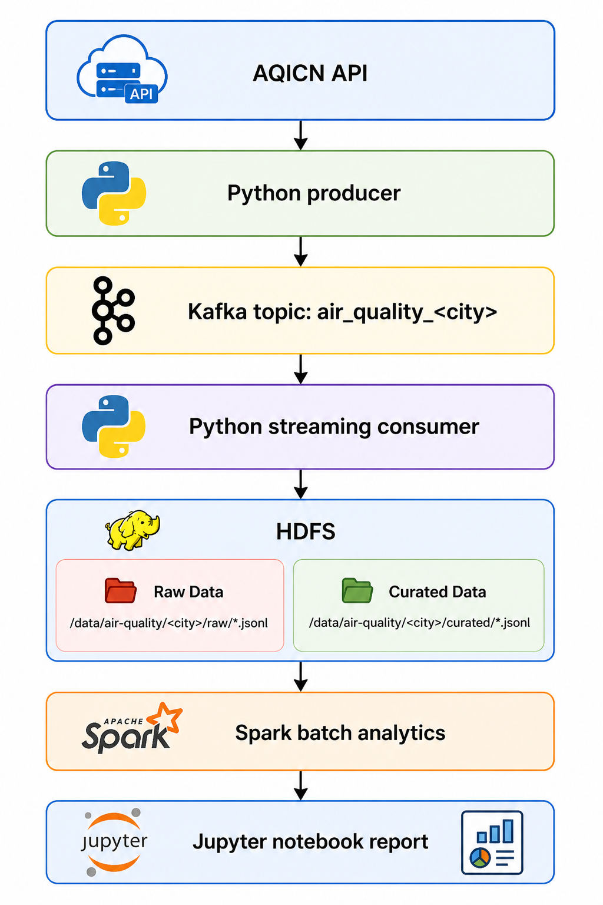

# Real-Time Air Quality Analytics Pipeline

### A Dockerized data pipeline for collecting, curating, and analyzing air quality data for AQICN-supported cities worldwide

---

## Features

- Fetches live air quality data for a configurable `CITY` from the **[AQICN API](https://aqicn.org/api/)**
- Publishes raw observations to **Kafka** with a dedicated ingestion producer
- Consumes **Kafka** messages and stores both raw and curated daily JSONL datasets in **HDFS**
- Deduplicates curated station observations before persisting them
- Runs **Spark** batch analytics over the curated HDFS dataset
- Exposes a **Jupyter** notebook container for exploring analytics results
- Includes a **Kafka UI** and **HDFS NameNode UI** for an easier inspection of the pipeline
- Containerized setup with **Docker Compose**

---

## Tech Stack

[](https://www.python.org/)
[](https://kafka.apache.org/)
[](https://hadoop.apache.org/)
[](https://spark.apache.org/)
[](https://jupyter.org/)
[](https://www.docker.com/)

- **Data Source**: AQICN city feed API
- **Ingestion Layer**: Python producer + Kafka
- **Streaming Layer**: Python consumer with curation and deduplication
- **Storage Layer**: HDFS with raw and curated JSONL outputs
- **Analytics Layer**: PySpark batch analysis in Jupyter
- **Runtime/Packaging**: Python 3.11 + uv + Docker
- **Orchestration**: Docker Compose

---

## How It Works

1. The `ingestion-producer` fetches air quality snapshots for the configured city from the AQICN API.
2. Each source payload is published to the city-specific Kafka topic derived from the `CITY` environment variable. For example, `CITY=sofia` uses `air_quality_sofia`.
3. The `streaming-consumer` reads Kafka records, groups them by day, and writes:
   - raw payloads to HDFS
   - curated, deduplicated observations to HDFS
4. The `analytics-notebook` container reads the curated HDFS dataset with Spark.
5. Batch analytics tables are generated for AQI trends, pollutant averages, pollutant frequency, and weather correlations.

### Pipeline Schema

<div style="text-align: center;">
  
</div>

### Analytics Outputs

The batch analysis produces these report tables:

- `hourly_aqi`: average AQI grouped by hour of day
- `daily_aqi`: average AQI grouped by calendar day
- `aqi_category_distribution`: AQI counts grouped by AQI category
- `average_pollutants`: mean pollutant values grouped dynamically by pollutant name, such as `pm10`, `pm25`, `no2`, or `o3`
- `dominant_pollutants`: dominant pollutant counts ordered by frequency
- `weather_correlations`: AQI correlations with temperature, humidity, and wind

---

## Quick Start

### Requirements

- Docker
- Docker Compose
- Python 3.11 and uv for local synthetic data loading
- AQICN API token

### Clone the Repo

```sh
git clone https://github.com/BozhidarMindov/real-time-air-quality-analytics-pipeline.git
```

### Environment Variables (`.env`)

Create a `.env` file in the project root. Docker Compose reads this file and passes only the needed values to each service.

```dotenv
AQICN_API_TOKEN=<your_token> # # Required for the default live ingestion pipeline
CITY=sofia # Required
POLL_INTERVAL_SECONDS=300 # Optional (default=300; 5 minutes)
```

`CITY` is the active AQICN city feed. The Kafka topic and HDFS paths are derived from it:

```text
CITY=sofia
Kafka topic: air_quality_sofia
HDFS path: /data/air-quality/sofia/
```

Internal service settings such as `KAFKA_BOOTSTRAP_SERVERS`, `OUTPUT_ROOT`, `HDFS_NAMENODE_URL`, `HDFS_USER`, and `LOCAL_STAGING_DIR` are set in `docker-compose.yaml`.

### Docker Setup

1. Start the containers:

   ```sh
   docker compose up -d --build
   ```

2. When the containers are running, open the `real-time-air-quality-analytics-pipeline-analytics-notebook` container logs by executing:

   ```sh
   docker logs real-time-air-quality-analytics-pipeline-analytics-notebook
   ```

3. Look for the available Jupyter url logs, which should look something like this:

   ```txt
   [I 2026-04-12 11:25:26.074 ServerApp] http://localhost:8888/lab?token=<some-auto-generated-jupyter-token>
   [I 2026-04-12 11:25:26.074 ServerApp] http://127.0.0.1:8888/lab?token=<some-auto-generated-jupyter-token>
   ```

4. Click on either url to access the notebook (which is in the `notebooks` folder) and run the analytics.

### Useful URLs

- Kafka UI: `http://localhost:8080`
- HDFS NameNode UI: `http://localhost:9870`
- Jupyter Notebook: `http://localhost:8888`

### Synthetic Demo Data

The synthetic loader publishes AQICN-shaped raw records to the same city Kafka topic as the live producer. The existing streaming consumer then writes the raw and curated JSONL datasets to HDFS.   Synthetic data does not call the AQICN API, but the default Docker setup starts the live ingestion producer, so `.env` should still include `AQICN_API_TOKEN`. To run only the synthetic pipeline services without live ingestion, use the commands below. 

Start the main pipeline services (if the containers are already running, you can skip this step):

```sh
docker compose up -d --build kafka-broker namenode datanode1 datanode2 streaming-consumer kafka-ui
```

Load synthetic data locally. The script publishes to Kafka through the host-exposed broker on `localhost:9094`. The dockerized streaming consumer then writes to HDFS.

```sh
uv run python scripts/load_synthetic_data.py
```

With the default synthetic settings, this creates:

```text
15 days * 24 hours * 1 station = 360 records
```

The synthetic settings are optional and do not need to be present in `.env`. Override them only when you need a different synthetic dataset:

```dotenv
SYNTHETIC_DAYS=15
SYNTHETIC_INTERVAL_MINUTES=60
SYNTHETIC_STATION_COUNT=1
```

---

## Notes

- The pipeline is city-configurable through the required `CITY` environment variable. Sofia is only an example city.
- The producer requires `AQICN_API_TOKEN` and `CITY`. The streaming consumer and analytics job require `CITY`.
- Docker Compose is the intended runtime. It sets container-only service addresses such as `kafka-broker:9092` and `http://namenode:9870`.
- The Kafka topic is always derived from `CITY` as `air_quality_<CITY>`.
- Raw and curated datasets are written to HDFS under `/data/air-quality/<city>/`.
- The analytics notebook container is intended for interactive Spark exploration on top of the curated dataset.
- The live producer can poll every 5 minutes even when AQICN stations publish new measurements less frequently, such as hourly. This is still realistic because the pipeline checks for updates often, while curation deduplicates unchanged station observations.
- Synthetic data defaults to hourly timestamps, which better reflects how often station measurements commonly change. It should still be described as synthetic demo data, not as exact historical AQICN measurements.
- This project was completed as part of the **Big Data Engineering course** in the **Big Data Technologies** master's program at **Sofia University**.
